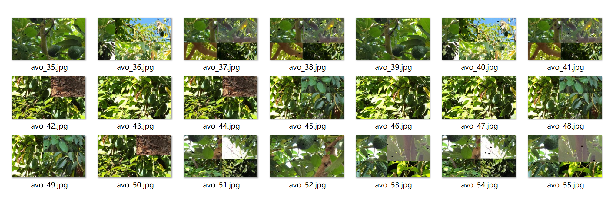
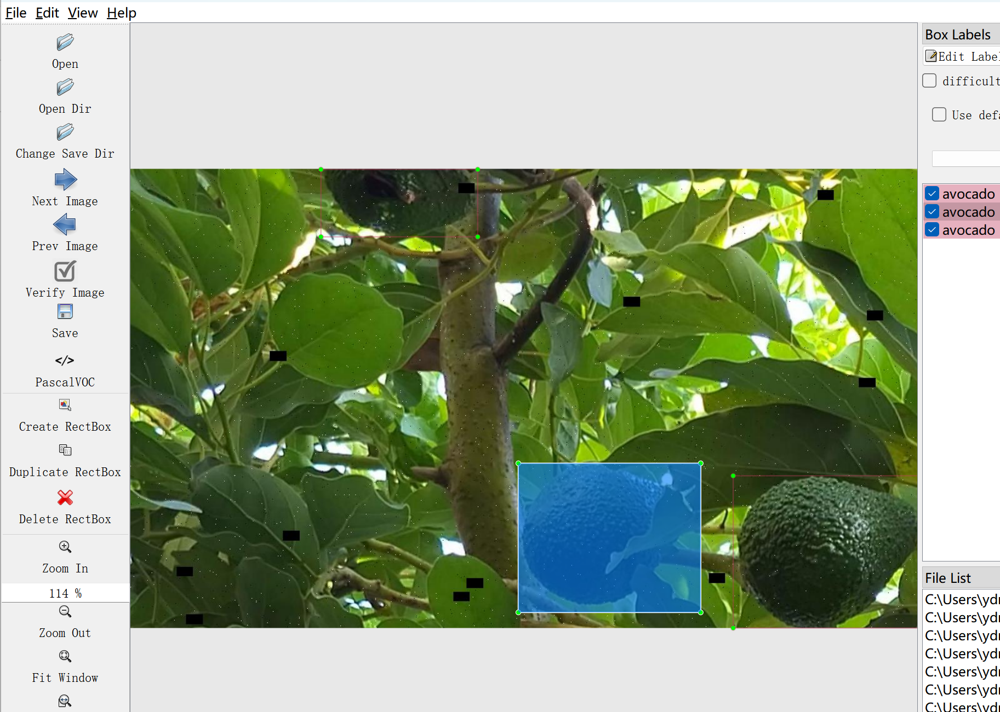
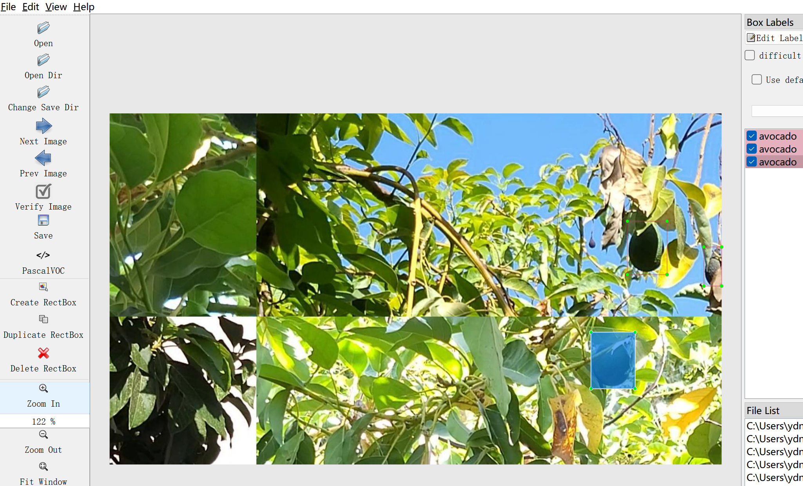

# Avocado Fruit Target Detection Dataset (Real-Environment)

Dataset Information Introduction: The dataset consists of a total of 2873 images and corresponding annotation files. The annotation format includes two types: VOC formatted XML files and YOLO formatted TXT files. The objects to be detected include the following:
- avocado

The number of bounding box information for each object is as follows:
- avocado: 11883

Note: In an image, multiple objects may be labeled, so the total number of bounding boxes may be greater than the number of images.

The complete dataset includes three folders and one TXT file:
- Image size information:
- File size information:
- The all_txt folder and classes.txt: store the yolo formatted TXT annotation files, in the same quantity as the images, with each annotation file corresponding to one image.
- classes.txt:

For a detailed understanding of the yolo format standard file, please search on your own. Simply put, the index number 0 represents the name at the array position 0 in the classes.txt file.
- All_xml file: VOC formatted XML annotation file.
- The quantity and images are the same, with each annotation file corresponding to one image.
- For a detailed understanding of the VOC format standard file, please search on your own.

Both formats of annotations can be used, choose one according to your preference.
Annotation screenshots:

## Images

Here is a pay link on Stripe ( https://buy.stripe.com/3cs8yP7sY87d0vu9AB ). Please contact me lonlonago@foxmail.com after funding $89, and I will send you a complete data files , thank you!

